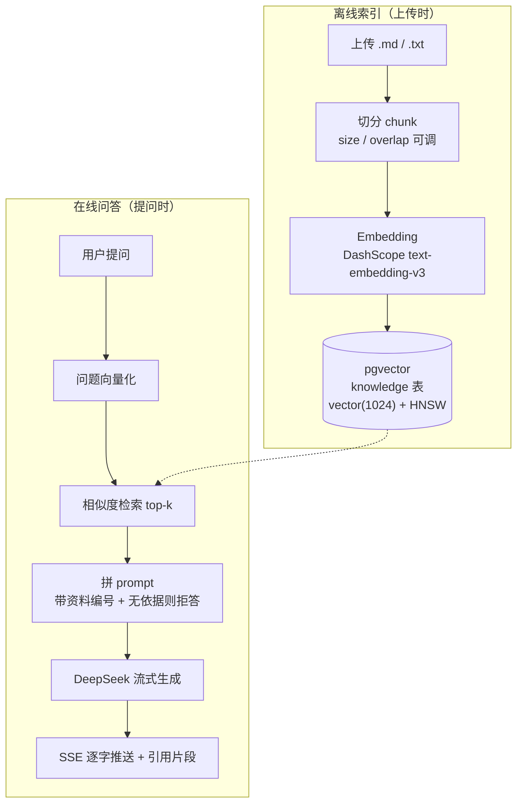

# RAG 知识库问答（Java + Spring AI）

> 上传文档 → 提问，答案只依据你上传的资料：带引用片段可溯源，资料里没有的内容明确拒答、不编造。

> **TODO（你来写，2–3 句）**：为什么做这个项目（Java 后端转型 AI 应用的第一个作品）、它替代了什么做法、你在其中负责什么。

## 演示

> **TODO（你来写）**：截图（提问结果 + 展开的 📎 引用片段）+ 30–60 秒 demo 视频链接（Win+Alt+R 录屏后上传）。

## 核心特性

- **上传即入库**：`.md` / `.txt` → 切分 → 向量化 → pgvector（离线索引链路）
- **流式问答**：SSE 逐字返回；引用片段**先于**回答推送（检索同步、生成异步，见架构说明）
- **可溯源**：每条回答附带命中的原文片段，不靠模型"记忆"
- **不瞎编**：资料中没有的内容直接回答"资料中没有相关信息"（实测稳定拒答，见评估文档）
- **内置调参评测台**：切分 / top-k 参数页面可选可调（请求时覆盖，**不用重启**），一键跑 8 道评估题，每题带预期提示与引用片段

## 技术栈

| 层 | 选型 |
|---|---|
| 应用框架 | Spring Boot 3.5.3 / Java 21 / Spring AI 1.1.8 |
| 向量库 | PostgreSQL 16 + pgvector（Docker），HNSW 索引 + 余弦距离，`vector(1024)` |
| 对话模型 | DeepSeek `deepseek-chat`（OpenAI 兼容协议） |
| Embedding | 阿里百炼 DashScope `text-embedding-v3`，1024 维（OpenAI 兼容模式） |
| 前端 | 原生 HTML + JS（SSE + FormData，无框架） |

## 架构



## 快速开始

前置：JDK 21、Maven、Docker

**1. 启动 pgvector**

```bash
docker run --name rag-pg -e POSTGRES_USER=postgres -e POSTGRES_PASSWORD=postgres \
  -e POSTGRES_DB=ragdb -p 5432:5432 -d pgvector/pgvector:pg16
```

> 国内拉不到镜像时用加速前缀：`docker pull docker.1ms.run/pgvector/pgvector:pg16`，再打回标准标签使用。

**2. 配置 API Key（只走环境变量，不进代码/仓库）**

```bash
setx DEEPSEEK_API_KEY "sk-xxx"     # DeepSeek 对话
setx DASHSCOPE_API_KEY "sk-xxx"    # 阿里百炼 embedding
```

**3. 启动并访问**

```bash
mvn spring-boot:run     # 端口 8081
```

打开 http://localhost:8081 → 上传 `sample-knowledge.md` → 提问；或点「④ 评测台」一键跑评估题。

**4. 命令行调试（可选）**

```bash
# 上传（带切分参数）
curl -F file=@sample-knowledge.md -F chunkSize=300 -F chunkOverlap=50 \
  http://localhost:8081/api/knowledge/upload

# 提问（带 top-k）
curl -X POST http://localhost:8081/api/chat -H "Content-Type: application/json" \
  -d '{"question":"试用期多久？","topK":3}'

# 清空知识库
curl -X POST http://localhost:8081/api/knowledge/clear
```

## 调参实验与评估

完整实验记录见 [`docs/evaluation.md`](docs/evaluation.md)。关键结论：

- **三组配置（300/50/3、150/30/3、600/100/5）答案质量无差异**——本切分器只在"段落超长"时才切，示例语料每段都短于最小的 chunk-size，**切分参数根本没生效**。教训：调参前先验证自变量真的在变。
- **真正的瓶颈是切分策略**：`## 标题` 被切成独立小块，语义弱却稳定占掉 top-k 里 1–2 个名额（标题块污染）。
- **top-k 3→5 是负优化**：答案不变，噪音块从 2 个涨到 4 个，token 成本上升。
- **语义检索有效**：提问"我不想每天去公司坐班"（句中无"远程"字样）仍命中远程办公段落——embedding 存在意义的直接证据。
- **拒答稳定**：库外问题（裁员赔偿）与部分覆盖问题（两万元培训费）在 k=3 / k=5、两版语料下均正确拒答，无幻觉。

> **TODO（你来写）**：你自己跑这轮实验时最意外的发现是什么？面试官问"你调过参吗"时，就讲这段。

## 踩坑记录

> **TODO（你来写，四条素材都在 docs 和提交历史里）**：
> 1. **404 双 `/v1`**：base-url 带了 `/v1`，Spring AI 客户端又拼一次 → 用 curl 对比 401（路径对）与 404（路径错）定位
> 2. **401 环境变量未加载**：`setx` 之后旧进程读不到；加了只打印"是否读到 + 长度"的诊断日志（绝不打印 key 值）
> 3. **400 embedding 单请求上限**：DashScope 单请求最多 10 条，改成每批 8 条分批入库
> 4. **配置验证踩"旧进程"**：改完 yml 没重启应用，测的其实是上一版配置——验证配置前先确认进程真的加载了它

## 项目结构

```
src/main/java/com/example/ragdemo/
├── config/LlmConfig.java        # 手动装配 DeepSeek(chat) + DashScope(embedding) + PgVectorStore
├── service/RagService.java      # 核心：切分入库(ingest) / 检索问答(ask, streamAsk) / 清库(clear)
├── web/RagController.java       # 接口：上传、清空、SSE 流式问答、同步问答
src/main/resources/
├── application.yml              # 参数与模型配置（key 走环境变量）
└── static/index.html            # 前端：上传 / 问答 / ④调参评测台
docs/evaluation.md               # 调参评估实验：题库、流程、结果、结论
sample-knowledge*.md             # 示例语料（含 16 节扩展版干扰项语料）
```

## 后续计划

1. **切分器改进**：标题与正文合并、过滤过短块、句子级切分（解决标题块污染）
2. **相似度阈值**：低于阈值直接拒答，减少"硬凑"引用
3. **Rerank**：召回 top-20 后接 bge-reranker 精排
4. **评估自动化**：接 RAGAS / LLM-as-judge，把人工对照预期升级为可回归的指标
